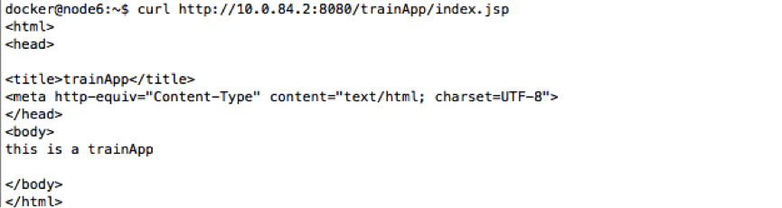
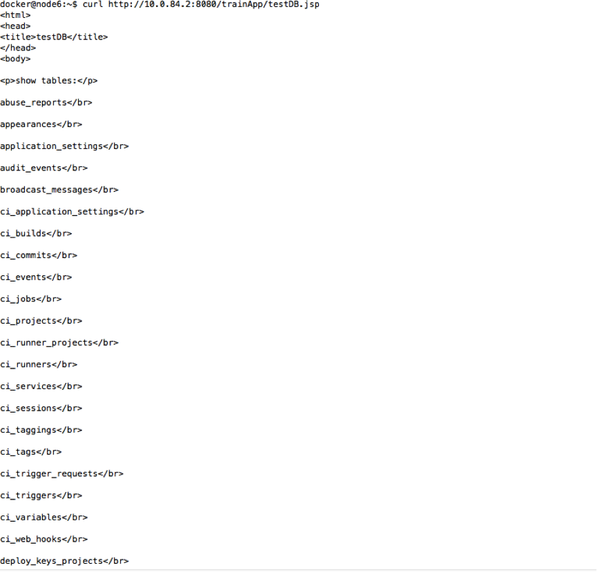
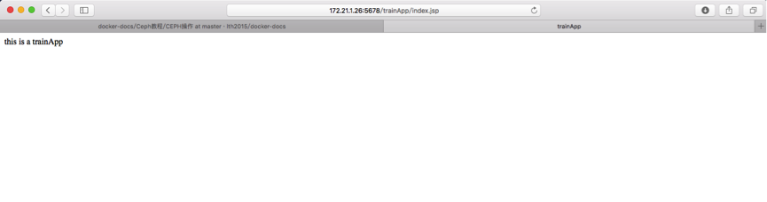
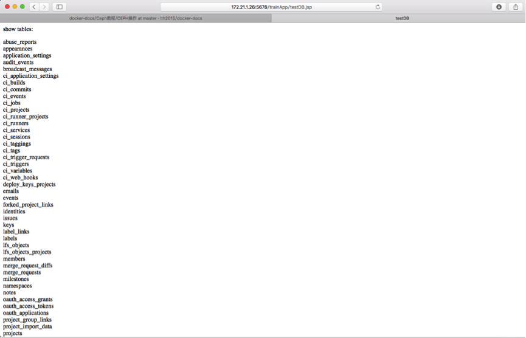

Docker极简教程——实操培训
-------------------------------------------------------

##### 题目

制作一个带数据源的web应用镜像，并运行。

##### 测试环境

登陆172.21.1.27 用户名：docker 密码：123456

```bash
ssh docker@172.21.1.27
```

构建镜像所需的文件在/home/train下，拷贝到自己的目录下使用, 例如:

```bash 
cp -r /home/train/* /home/docker/liyong
```

##### 编写Dockerfile

要求：

* 以ubuntu:lastest为基础镜像

* 使用命令修改apt软件源：

```bash
sed -i '/archive.ubuntu.com/s/archive.ubuntu.com/cn.archive.ubuntu.com/g' /etc/apt/sources.list
```

* 更新apt-get源

* 安装以下几个软件包：telnet、wget、curl、traceroute

* 将已经编辑好的本地profile文件添加到镜像里的/etc目录下

* 将已经编辑好的本地locale文件添加到镜像里的/etc/default目录下

* 将已经编辑好的localtime文件添加到镜像里的/etc目录下

* 将本地jdk1.7.0_75目录添加到镜像里的/usr/local目录下

* 配置环境变量JAVA_HOME＝/usr/local/jdk1.7.0_75

* 配置环境变量LANG＝en_US.UTF-8

* 将本地apache-tomcat-7.0.57目录添加到镜像里的/apps/product目录下，并改名为tomcat7,即/apps/product/tomcat7

* 将本地server.xml文件添加到镜像里的/apps/product/tomcat7/conf目录下

* 将本地trainApp.xml文件添加到镜像里的/apps/product/tomcat7/conf/Catalina/localhost目录下

* 将本地mysql-connector-java-5.1.9.jar文件添加到镜像里的/apps/product/tomcat7/lib目录下

* 将本地trainApp.war文件添加到镜像里的/apps/product/tomcat7/webapps目录下

* 暴露端口8080

* 设定容器启动时运行命令：/apps/product/tomcat7/bin/catalina.sh run


##### 构建镜像

要求：

* 镜像命名为tomcat7_加你的姓名,并设定版本号为v1，例如：tomcat7_liyong:v1

* 将镜像推送到镜像仓库中，例如：registry.test.com:5000/tomcat7_liyong:v1

##### 启动容器

登录172.21.1.26 运行你的镜像 用户名：docker 密码：123456

要求：

* 后台运行

* 给容器起一个名字tomcat7_加你的姓名，例如：tomcat7_liyong

* 使用宿主机的端口号映射到容器内的8080，端口号使用你的手机号的后4位，如手机号为13912345678，宿主机的端口号就使用5678

* 将容器内的/apps/product/tomcat7/logs目录，映射到宿主机的/home/docker/logs/你的姓名目录，例如/home/docker/logs/liyong


##### 查看效果

要求：

使用docker inspect命令查找docker的IP，然后使用下面两个curl命令查看效果:

```bash
curl http://you container ip:8080/trainApp/index.jsp
```

返回结果如下：


```bash
curl http://you container ip:8080/trainApp/testDB.jsp
```

结果应该如下图所示：




用浏览器，使用宿主机IP加端口访问查看效果:

```bash
http://172.21.1.26:your port/trainApp/index.jsp
```



```bash
http://172.21.1.26:your port/trainApp/testDB.jsp
```




##### 参考

[Docker极简教程——Dockfile篇](https://github.com/lth2015/docker-docs/tree/master/Docker%E6%9E%81%E7%AE%80%E6%95%99%E7%A8%8B/Docker%E6%9E%81%E7%AE%80%E6%95%99%E7%A8%8B%E2%80%94%E2%80%94Dockfile%E7%AF%87)

[Docker极简教程——容器篇](https://github.com/lth2015/docker-docs/tree/master/Docker%E6%9E%81%E7%AE%80%E6%95%99%E7%A8%8B/Docker%E6%9E%81%E7%AE%80%E6%95%99%E7%A8%8B%E2%80%94%E2%80%94%E5%AE%B9%E5%99%A8%E7%AF%87)

[Docker极简教程——镜像篇](https://github.com/lth2015/docker-docs/tree/master/Docker%E6%9E%81%E7%AE%80%E6%95%99%E7%A8%8B/Docker%E6%9E%81%E7%AE%80%E6%95%99%E7%A8%8B%E2%80%94%E2%80%94%E9%95%9C%E5%83%8F%E7%AF%87)
