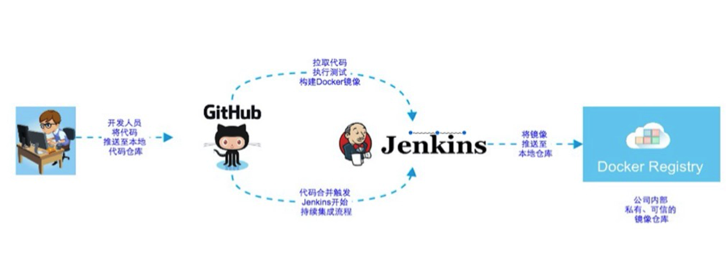

Docker极简教程—-持续构建篇
========================================================

#### 前言 
-------------------------------------------------------

关于Docker的使用方式和使用场景有很多争论，但是，对于Docker用于改建持续构建这个场景来说没有什么争议。很多公司已经使用docker完成了持续构建的流程，实现了快速软件发布。

持续集成或者说持续发布是个很大的话题，涉及方方面面，不能理解成仅仅是一个docker镜像构建的过程。作为实例教程，我们今天的话题不涉及持续集成和持续发布，我们只介绍构建过程。


#### 构建流程
-------------------------------------------------------

先看下面这张图，它描述了整个构建过程：


* 开发人员提交代码到源码仓库（gitlab），根据设定的条件自动触发jenkins构建。

* 构建成功后，从存放的Docker的git仓库中获得该项目的Dockfile，执行docker build镜像。

* 将镜像推送至公司内部的私有镜像仓库


#### 搭建实例
-------------------------------------------------------

##### Gitlab搭建

* 使用docker启动redis

```bash
docker run --name=gitlab_redis -tid -p 16379:6379 registry.test.com:5000/liyong/redis
```

* 使用docker启动mysql

```bash
docker run --name=gitlab_mysql -tid -e 'DB_NAME=gitlabhq_production' -e 'DB_USER=gitlab' \
                 -e 'DB_PASS=password'  -v /opt/gitlab/mysql:/var/lib/mysql \
                            -p 13306:3306 registry.test.com:5000/liyong/mysql
```

* 使用docker启动gitlab

```bash
docker run --name gitlab -d --link gitlab_mysql:mysql \
      --link gitlab_redis:redisio  --publish 10022:22 --publish 10080:80 --publish 10443:443 \
              --env 'GITLAB_PORT=10080' --env 'GITLAB_SSH_PORT=10022' \
                      --env 'GITLAB_SECRETS_DB_KEY_BASE=long-and-random-alpha-numeric-string' \
                          --volume /srv/docker/gitlab/gitlab:/home/git/data \
                              registry.test.com:5000/liyong/gitlab
```

##### 初始化Gitlab账户

注册一个Gitlab账户，然后进入数据库直接将该用户置为已验证状态

```bash
docker exec -ti gitlab_mysql /bin/bash

mysql -ugitlab -ppassword -Dgitlabhq_production -e "update users set confirmed_at = created_at where username='liyong'"

mysql -ugitlab -ppassword -Dgitlabhq_production -e "commit"
```

构建一个支持docker in docker的Jenkins镜像

> 何为docker in docker?
> 因为jenkins本身是以docker方式运行的，而在jenkins代码构建完成的最后一步，需要打docker镜像，因此需要在运行jenkins的docker容器内部，再运行一套docker环境，在一个docker容器内部运行docker环境，需要一些特殊的处理，否则docker deamon起不来

* 准备executors.groovy文件

```bash
cat >> executors.groovy <<EOF

import jenkins.model.*'

Jenkins.instance.setNumExecutors(5)

EOF
```

* 准备log.properties文件

```bash
cat > log.properties <<EOF

handlers=java.util.logging.ConsoleHandler

jenkins.level=FINEST

java.util.logging.ConsoleHandler.level=FINEST

EOF
```

* 准备dind文件

```bash
docker pull docker:1.8-dind

docker run --privileged --name docker-in-docker -d docker:1.8-dind

docker cp docker-in-docker:/usr/local/bin/dind .
```

* 准备docker-entrypoint.sh

```bash
cat >> dockerd-entrypoint.sh <<EOF

#!/bin/sh
set -e

if [ "$#" -eq 0 ]||[ "${1:0:1}" = '-' ]; then
	set -- docker daemon \
		--host=unix:///var/run/docker.sock \
		--host=tcp://0.0.0.0:2375 \
		--storage-driver=vfs \
		"$@"
fi

if [ "$1" = 'docker' ]&&[ "$2" = 'daemon' ]; then
	# if we're running Docker, let's pipe through dind
	# (and we'll run dind explicitly with "sh" since its shebang is /bin/bash)
	set -- sh "$(which dind)" "$@"
fi

exec "$@" &
EOF
```

* 编写Dockerfile

```bash
cat >> Dockerfile <<EOF

FROM jenkins
ADD executors.groovy /usr/share/jenkins/ref/init.groovy.d/executors.groovy
USER root
RUN apt-get update
RUN curl -sSL https://get.docker.com/ | sh
RUN usermod -a -G docker root
RUN usermod -a -G docker jenkins
RUN apt-get install -y sudo
RUN chmod u+w /etc/sudoers
RUN echo 'jenkins ALL=(ALL)       NOPASSWD: ALL'>>/etc/sudoers
RUN chmod u-w /etc/sudoers
RUN apt-get install -y vim
ADD dind /usr/local/bin/
RUN chmod +x /usr/local/bin/dind
ADD dockerd-entrypoint.sh /usr/local/bin/
RUN chmod +x /usr/local/bin/dockerd-entrypoint.sh
ADD log.properties /var/jenkins_home/
ENV JAVA_OPTS="-Djava.util.logging.config.file=/var/jenkins_home/log.properties"
RUN mkdir -p /etc/docker/certs.d/registry.test.com\:5000/
ADD domain.crt /etc/docker/certs.d/registry.test.com\:5000/
VOLUME /var/lib/docker
EXPOSE 2375
EOF
```

* 构建镜像

```bash
docker build -t liyong/jenkins-in-docker .

docker tag liyong/jenkins-in-docker registry.test.com:5000/liyong/jenkins-in-docker

docker push registry.test.com:5000/liyong/jenkins-in-docker
```

* 运行，注意--privileged一定要加

```bash
docker run --privileged  --name jenkins-in-docker -d \
        -p 18080:8080 -p 50000:50000 -v /var/jenkins_home:/var/jenkins_home \
        registry.test.com:5000/liyong/jenkins-in-docker
```

#### 搭建存放Dockfile、
从“基础设施即代码”(Infrastructure as Code)的理念里我们
