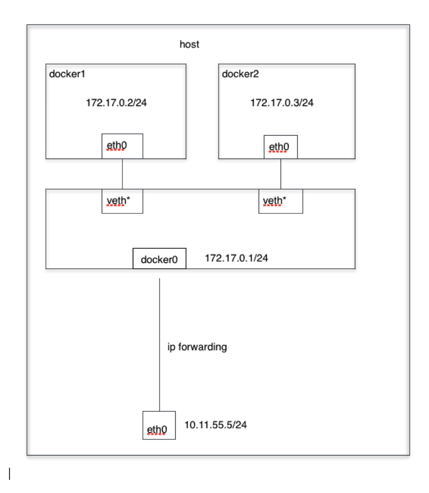
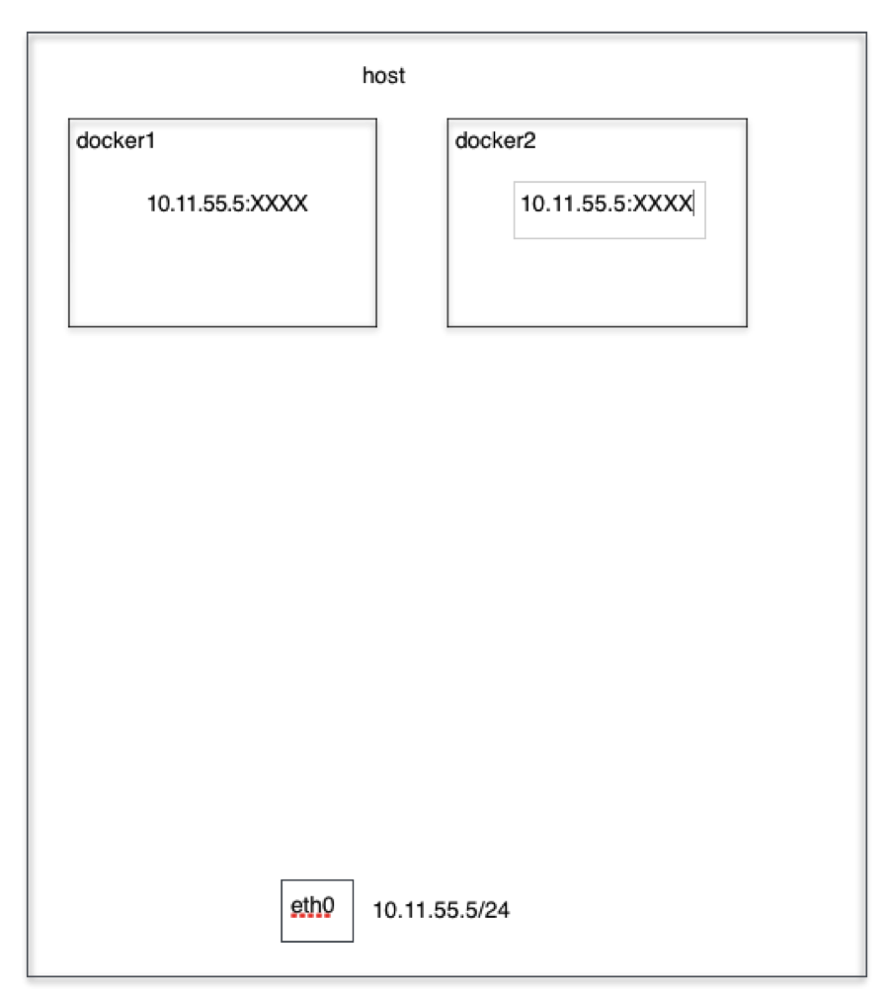
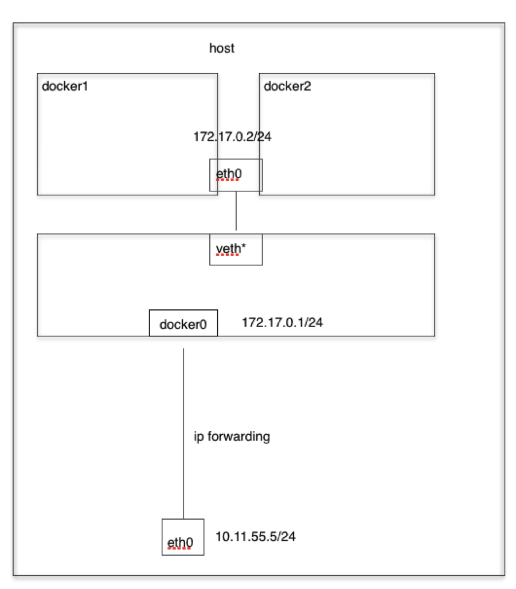
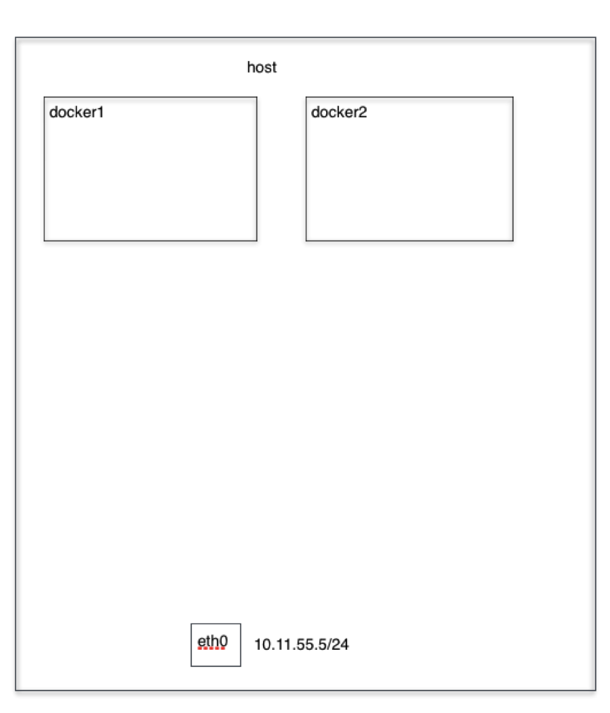
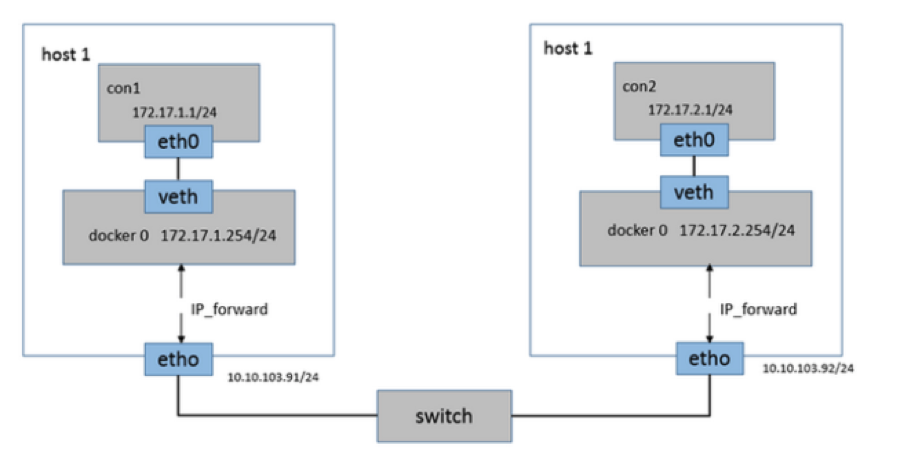
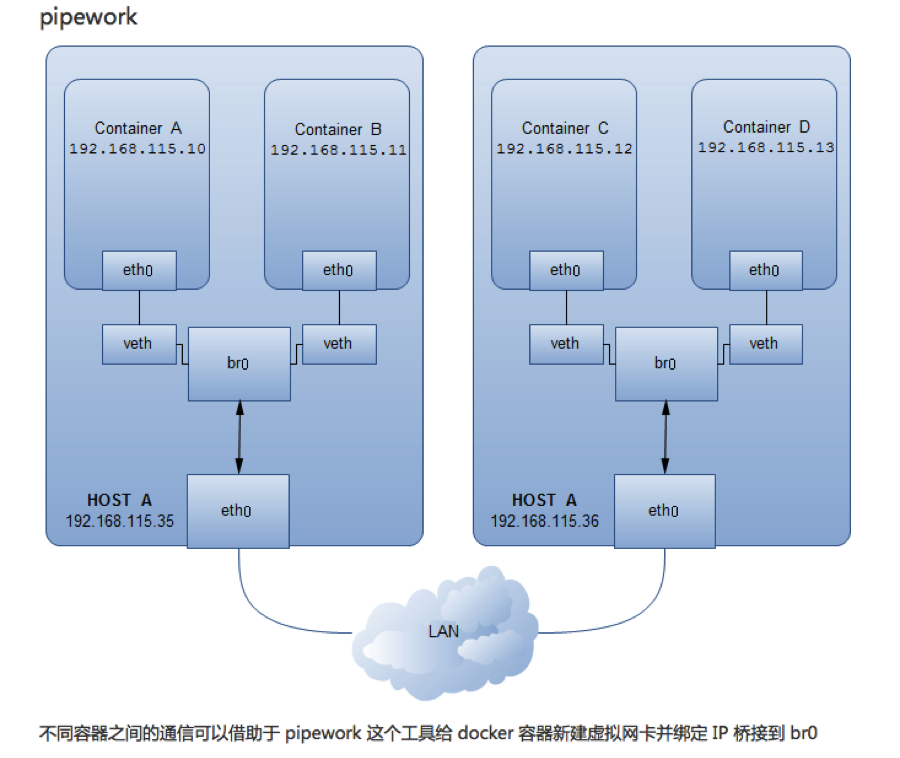
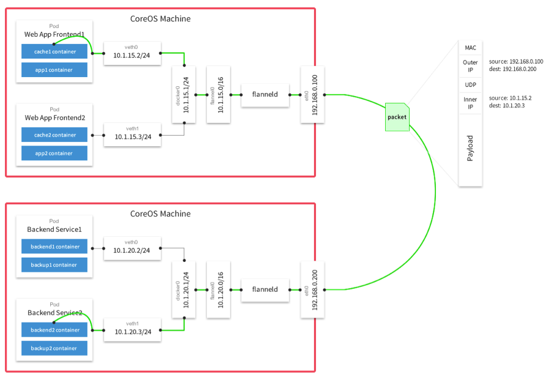

Docker极简教程—-网络篇
========================================================

### Docker的四种网络模式
--------------------------------------------------------

#### Bridge模式

当Docker进程启动时，会在主机上创建一个名为docker0的虚拟网桥，此主机上启动的Docker容器会连接到这个虚拟网桥上。虚拟网桥的工作方式和物理交换机类似，这样主机上的所有容器就通过交换机连在了一个二层网络中。

从docker0子网中分配一个IP给容器使用，并设置docker0的IP地址为容器的默认网关。在主机上创建一对虚拟网卡veth pair设备，Docker将veth pair设备的一端放在新创建的容器中，并命名为eth0（容器的网卡），另一端放在主机中，以vethxxx这样类似的名字命名，并将这个网络设备加入到docker0网桥中。可以通过brctl show命令查看。

bridge模式是docker的默认网络模式，不写--net参数，就是bridge模式。使用docker run -p时，docker实际是在iptables做了DNAT规则，实现端口转发功能。可以使用iptables -t nat -vnL查看。

bridge模式如下图所示：


演示：
```bash
docker run -tid --net=bridge --name docker_bri1 ubuntu-base:v3
docker run -tid --net=bridge --name docker_bri2 ubuntu-base:v3 

brctl show
docker exec -ti docker_bri1 /bin/bash
docker exec -ti docker_bri1 /bin/bash

ifconfig –a
route –n
```

#### Host模式

如果启动容器的时候使用host模式，那么这个容器将不会获得一个独立的Network Namespace，而是和宿主机共用一个Network Namespace。容器将不会虚拟出自己的网卡，配置自己的IP等，而是使用宿主机的IP和端口。但是，容器的其他方面，如文件系统、进程列表等还是和宿主机隔离的。

Host模式如下图所示：


演示：
```bash
docker run -tid --net=host --name docker_host1 ubuntu-base:v3
docker run -tid --net=host --name docker_host2 ubuntu-base:v3

docker exec -ti docker_host1 /bin/bash
docker exec -ti docker_host1 /bin/bash

ifconfig –a
route –n
```

#### Container模式

这个模式指定新创建的容器和已经存在的一个容器共享一个 Network Namespace，而不是和宿主机共享。新创建的容器不会创建自己的网卡，配置自己的 IP，而是和一个指定的容器共享 IP、端口范围等。同样，两个容器除了网络方面，其他的如文件系统、进程列表等还是隔离的。两个容器的进程可以通过 lo 网卡设备通信。

Container模式示意图：


演示：
```bash
docker run -tid --net=container:docker_bri1 --name docker_con1 ubuntu-base:v3

docker exec -ti docker_con1 /bin/bash
docker exec -ti docker_bri1 /bin/bash

ifconfig –a
route -n
```

#### None模式

使用none模式，Docker容器拥有自己的Network Namespace，但是，并不为Docker容器进行任何网络配置。也就是说，这个Docker容器没有网卡、IP、路由等信息。需要我们自己为Docker容器添加网卡、配置IP等。

Node模式示意图


演示：
```bash
docker run -tid --net=none --name docker_non1 ubuntu-base:v3

docker exec -ti docker_non1 /bin/bash

ifconfig –a
route -n
```


### Docker的跨主机通信
--------------------------------------------------------

Docker默认的网络环境下，单台主机上的Docker容器可以通过docker0网桥直接通信，而不同主机上的Docker容器之间只能通过在主机上做端口映射进行通信。这种端口映射方式对很多集群应用来说极不方便。如果能让Docker容器之间直接使用自己的IP地址进行通信，会解决很多问题。按实现原理可分别**直接路由方式**、**桥接方式**（如*pipework*）、**Overlay隧道方式**（如*flannel*、*ovs+gre*）等。

#### 直接路由

通过在Docker主机上添加静态路由实现跨宿主机通信：




#### Pipework

Pipework是一个简单易用的Docker容器网络配置工具。由200多行shell脚本实现。通过使用ip、brctl、ovs-vsctl等命令来为Docker容器配置自定义的网桥、网卡、路由等。

* 使用新建的bri0网桥代替缺省的docker0网桥
* bri0网桥与缺省的docker0网桥的区别：bri0和主机eth0之间是veth pair



#### Flannel(Flannel + UDP 或者 Flannel + VxLAN)

Flannel实现的容器的跨主机通信通过如下过程实现：

* 每个主机上安装并运行etcd和flannel；

* 在etcd中规划配置所有主机的docker0子网范围；

* 每个主机上的flanneld根据etcd中的配置，为本主机的docker0分配子网，保证所有主机上的docker0网段不重复，并将结果（即本主机上的docker0子网信息和本主机IP的对应关系）存入etcd库中，这样etcd库中就保存了所有主机上的docker子网信息和本主机IP的对应关系；

* 当需要与其他主机上的容器进行通信时，查找etcd数据库，找到目的容器的子网所对应的outip（目的宿主机的IP）；

* 将原始数据包封装在VXLAN或UDP数据包中，IP层以outip为目的IP进行封装；

* 由于目的IP是宿主机IP，因此路由是可达的；

* VXLAN或UDP数据包到达目的宿主机解封装，解出原始数据包，最终到达目的容器。

Flannel模式如下图所示：


演示：

```bash
/opt/bin/etcdctl get /coreos.com/network/config
/opt/bin/etcdctl ls /coreos.com/network/subnets
/opt/bin/etcdctl get /coreos.com/network/subnets/172.16.49.0-24
```
