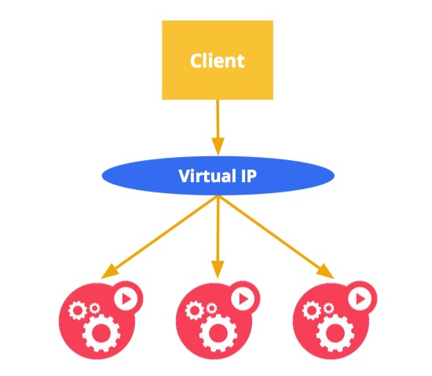
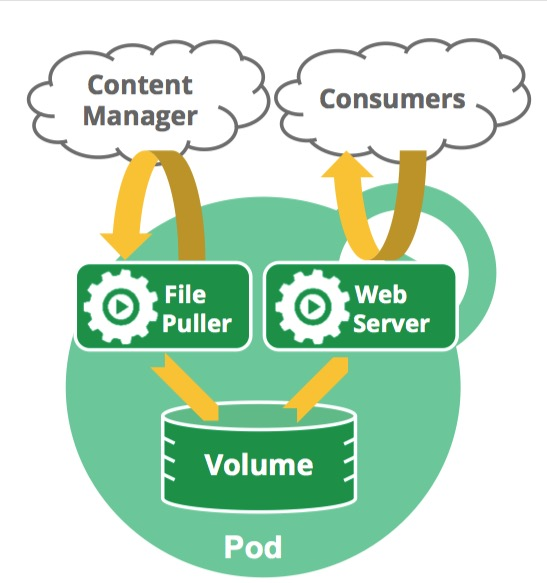
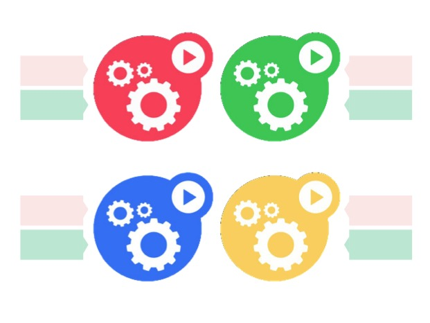
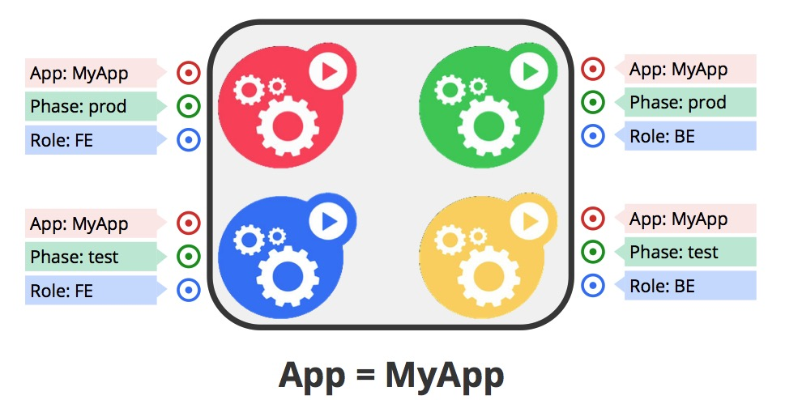

Kubernetes入门——基本概念
--------------------------------------------------------------------------------------------------------------------------------------


#### Kubernetes是什么？

Kubernetes是谷歌开源的容器编排引擎，架构和设计思想来源于谷歌内部使用调度工具——Borg。Borg是谷歌一个久负盛名的的内部使用的大规模集群管理系统，它基于Linux Container(LXC)技术，目的是实现资源管理的自动化，以及跨多个数据中心的资源利用率最大化。Borg，或者说LXC技术，在谷歌已经有了十多年的稳定运行经验。2015年4月，伴随着[Borg的论文](Large-scale cluster management at Google with Borg.pdf)公开发表，Kubernetes也横空出世，迅速占领了容器编排的领袖地位。

Kubernetes是一套完备的容器集群管理引擎，它提供了各种机制和接口来保证应用的快速发布和健康运行，提供了丰富的命令行工具（CLI）和API接口，便于与集群交互，同时Kubernetes提供了多层次的安全防护和隔离机制，多租户应用的支撑能力，应用的全生命周期管理，可扩展的自动资源调度机制，多粒度的资源配额管理能力，多租户支持的统一配置管理组件，多可用区域支撑……，Kubernetes提供了一整套完善的容器管理工具，为容器集群管理提供了一站式服务。

#### Kubernetes基本知识

在Kubernetes中，有几个基本概念：



+ *Service*: Kubernetes内部的服务资源，它可以将多个应用实例结合在一起，对外暴露一个服务（即Service），同时，它可以定义访问模式（HTTP/TCP/UDP）和端口号，并以一个虚拟IP的形式发布出来，它拥有一个制定的名字，在容器内部，可以通过这个名字来访问这个Service代表的应用实例，在访问期间，Service自动按照Round-Robin的策略来做负载均衡。




+ *Pod*: Kubernetes中应用的概念，它是有一个或者一组容器组成，用于运行各种应用，Pod是Kubernetes应用调度的最小单元，比如，通过Kubernetes要运行一个Nginx容器，那么，就需要将Nginx容器发在一个Pod中，在Kubernetes中部署运行。Service所抽象的应用实例，就是指的是这些Pod。


+ *Replication* *Controller*(下文简称RC): Kubernete的副本控制器，它用于控制存活的Pod（应用）实例个数，即副本数。它会每隔一段时间（5s）通过Kubernetes的管理节点来查询它控制下的副本个数，如果没有达到预先制定的个数，那么就创建新的Pod已达到设定的副本数。Pod（应用）的扩容，只需通过修改Replica的个数就能轻松完成。


+ *Node*: 实际运行容器的计算节点（物理机或者虚拟机）。



+ *Label*: Kubernetes资源的元数据，Pod可以通过Label标示自己的应用名称，角色等，Service，Replication Controller可以同过选择这些标签来找到自己所要管理的Pod，Node也可以做标记，可以让Pod在特定的Node上调度运行。



+ *Selector*：选择器，Service, Replication Controller通过Selector来选择自己的Pod

#### 为什么要使用Kubernetes

Docker技术从发布到现在，受到了互联网行业的热烈追捧，在很多公司的生产环境中都使用了Docker技术。但是，随着Docker的使用场景和容器个数的增加，从单机运行Docker走向集群部署已成为必然趋势，而Kubernetes正是为业界准备了一套完备的、被广泛认可的容器集群管理工具。Kubernetes系出名门，从稳定性到社区活跃度，都是无需担心的，它的功能完备，并且简单易用，更给人一种”四两拨千斤“的感觉。

在不知道Kubernetes存在的情况下，团队在做项目规划时已经讨论出一套比较完整的容器引擎设计方案。在容器集群编排组件的调研过程中，发现Kubernetes跟我们的预想方案最接近，而且设计的那么完善，加上社区活跃度和Borg的经验，我们选择了Kubernetes作为资源调度引擎。

#### Kubernetes的命令行管理工具

使用kubectl命令从文件（yaml/json）中创建、销毁Pod、RC、Service、Node等资源。

+ 创建、销毁一个Pod

```bash
kubectl create -f a-pod.yaml/json
kubectl delete -f a-pod.yaml/json
```

+ 创建一个RC

```bash
kubectl create -f a-rc.json/yaml
kubectl delete -f a-rc.json/yaml
```

+ 创建一个Service

```bash
kubectl create -f a-rc.json/yaml
kubectl delete -f a-rc.json/yaml
```

+ 查看已有的Pod，RC，Service， Node

```bash
kubectl get pod,rc,svc
kubectl get node
```

+ 查看Pod的日志

```bash
kubectl logs ${Pod-Name}
```

#### Kubernetes的Hello World

通过Pod的方式运行一个busybox，并打印Hello world

创建一个Pod的yaml文件

```bash
cat > busybox-pod.yaml
```

```yaml
apiVersion: v1
kind: Pod 
metadata:
  name: busybox
  namespace: default
spec:
  containers:
  - image: busybox
    command:
      - echo
      - "Hello world"
    imagePullPolicy: IfNotPresent
    name: busybox
```

使用命令行工具来创建这个Pod：

```bash
kubectl create -f busybox-pod.yaml
```

查看Pod的创建情况

```bash
kubectl logs busybox
Hello world
```
