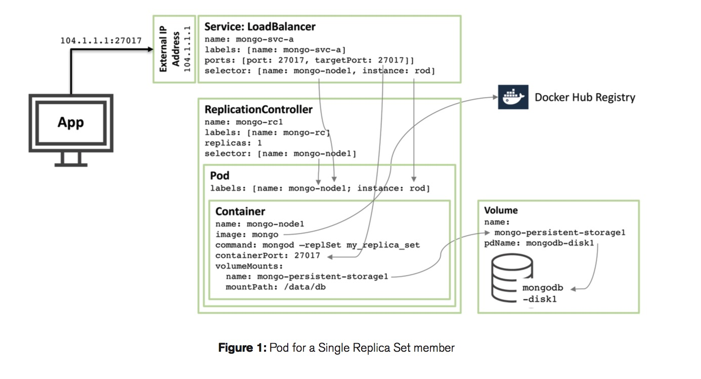
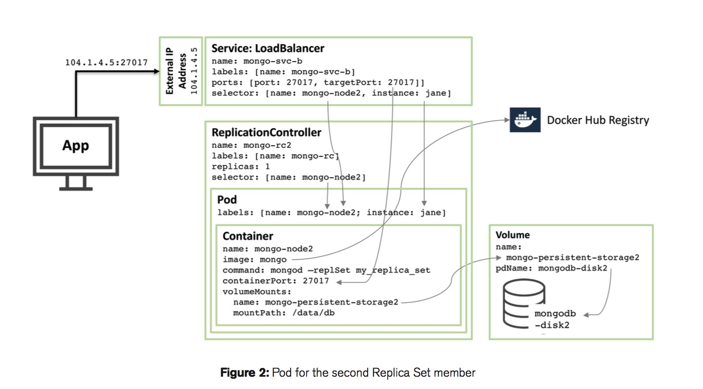
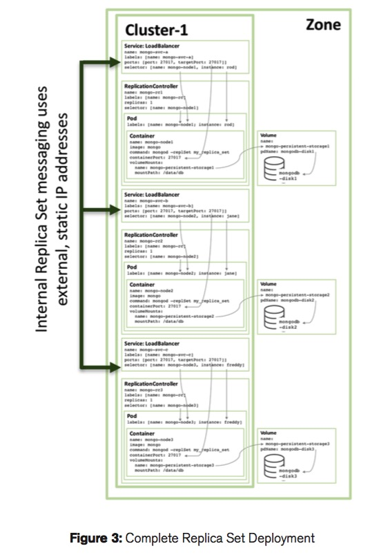

使用Kubernetes和Ceph RBD部署MongoDB副本集集群
================================================================

#### MongoDB副本集案例：单个节点
---------------------------------------------------------------

##### 使用Kubernetes ReplicationController
在GCE环境中使用Kubernetes和持久存储构建单个节点的副本集:



在公司的私有环境中，选择Ceph RBD作为永久性存储是个好的选择。

使用yaml文件定义一个单节点的MongoDB副本集：

```yaml
#	Copyright 2016, Google, Inc.
# Licensed under the Apache License, Version 2.0 (the "License");
# you may not use this file except in compliance with the License.
# You may obtain a copy of the License at
#
#    http:#www.apache.org/licenses/LICENSE-2.0
#
# Unless required by applicable law or agreed to in writing, software
# distributed under the License is distributed on an "AS IS" BASIS,
# WITHOUT WARRANTIES OR CONDITIONS OF ANY KIND, either express or implied.
# See the License for the specific language governing permissions and
# limitations under the License.

kind: ReplicationController
apiVersion: v1
metadata:
  name: mongo-1
spec:
  replicas: 1
  selector:
    name: mongo-node-1
    role: mongo
    environment: test
  template:
    spec:
      containers:
        - name: mongo-node-1
          image: mongo:latest
          command:
            - mongod
            - "--replSet"
            - rs0
            - "--smallfiles"
            - "--noprealloc"
          ports:
            - containerPort: 27017
          volumeMounts:
          - name: mongo-node-1
            mountPath: /data/db
      volumes:
      - name: mongo-node-1
        rbd: 
          monitors:
            - "172.21.1.11:6789"
          pool: rbd
          image: mongo-node-1
          secretRef:
            name: ceph-secret
          fsType: ext4
          readOnly: false
    metadata:
      labels:
        name: mongo-node-1
        role: mongo
        environment: test
```

图一展示了一个Pod、ReplicationController和Service之间的关系：

* 最重要是先启动一个叫mongo-node-1的容器，它的镜像采用[Docker Hub](https://hub.docker.com/_/mongo/)上的官方镜像。容器暴露27017端口用于外部访问


* Kubernetes的副本控制器(ReplicationController) mongo-node-1使用Ceph RBD作为永久数据存储。 容器中的"/data/db"会被挂载在被称为“mongo-node-1"的一个RBD的块设备上，它的文件系统被格式化为ext4。如果mongo的容器被重新调度，新的容器会重新挂载上"mongo-node-1”这个块设备，数据不会丢失。

* 负载均衡器(LoadBalancer)暴露了一个固定的IP地址用于外部访问，这个固定IP的27017端口已经被映射到那些mongo的容器的27017端口上了。负载均衡服务可以通过选择器（Selector）来自动选择那些合适的pod。

##### 使用Kubernetes的Service组件作为一个负载均衡器

通过一个yaml文件定义“mongo—svc-1”服务：

```yaml
#	Copyright 2016, Google, Inc.
# Licensed under the Apache License, Version 2.0 (the "License");
# you may not use this file except in compliance with the License.
# You may obtain a copy of the License at
#
#    http:#www.apache.org/licenses/LICENSE-2.0
#
# Unless required by applicable law or agreed to in writing, software
# distributed under the License is distributed on an "AS IS" BASIS,
# WITHOUT WARRANTIES OR CONDITIONS OF ANY KIND, either express or implied.
# See the License for the specific language governing permissions and
# limitations under the License.

apiVersion: v1
kind: Service
metadata:
  labels:
    name: mongo-1
  name: mongo-1
spec:
  ports:
    - port: 27017
      targetPort: 27017
  selector:
    name: mongo-node-1
```

##### 创建一个块设备并使用它

在您只用rbd命令之前，您需要安装一个ceph的集群在您的计算集群中。


创建一个10GB大小的RBD Image，并将它挂载:

```bash
rbd create mongo-node-1 -s 10240

rbd map mongo-node-1

rbd showmapped

id pool image        snap device    

0  rbd  mongo-node-1 -    /dev/rbd0

```

使用ext4来格式化块设备:

```bash
mkfs.ext4 /dev/rbd0
```

卸载这个块设备：

```bash
rbd unmap /dev/rbd0
```

按照这种方式，分别创建另外两个块设备mongo-node-2和mongo-node-3

##### 创建对应RC和Service：

```bash
kubectl create -f mongo-rc-rbd-1.yaml
kubectl create -f mongo-svc-1.yaml
```

#### MongoDB副本集: 三个节点
---------------------------------------------------------------

图二显示了如何配置另外一个replica set的成员：




---------------------------------------------------------------

图三显示了整个目标集群的示意图:



##### 创建三个节点的Replica Set：

```bash
kubectl create -f mongo-rc-rbd-1.yaml
kubectl create -f mongo-rc-rbd-2.yaml
kubectl create -f mongo-rc-rbd-3.yaml
```

##### 为每个mongodb的容器节点创建一个对应的服务：

```bash
kubectl create -f mongo-svc-1.yaml
kubectl create -f mongo-svc-2.yaml
kubectl create -f mongo-svc-3.yaml
```

还可以创建一个统一的服务，让用户使用起来更加方便：

```bash
kubectl creat -f mongo-svc.yaml
```


#### 初始化MongDB Replica Set集群
---------------------------------------------------------------

得到统一服务（Service）的IP地址：

```bassh
kubectl get svc mongo-svc

NAME        LABELS           SELECTOR                      IP(S)          PORT(S)
mongo-svc   name=mongo-svc   environment=test,role=mongo   192.168.3.62   27017/TCP

kubectl describe svc mongo-svc

Name:			mongo-svc
Namespace:		default
Labels:			name=mongo-svc
Selector:		environment=test,role=mongo
Type:			NodePort
IP:			192.168.3.62
Port:			<unnamed>	27017/TCP
NodePort:		<unnamed>	32017/TCP
Endpoints:		172.16.44.2:27017,172.16.7.2:27017,172.16.7.3:27017
Session Affinity:	None
No events.
```


```bash
mongo --host 172.16.44.2
```

```javascript
config = {
    "_id" : "rs0",
    "members" : [
                  {
                     "_id" : 1,
                     "host" : "mongo-1.default.svc:27017",
                     priority: 4
                  },
                  {
                     "_id" : 2,
                     "host" : "mongo-2.default.svc:27017",
                     priority: 3
                  },
                  {
                     "_id" : 3,
                     "host" : "mongo-3.default.svc:27017",
                     priority: 3
                  }
     ]
}
```

```bash
rs.reconfig(config, {"force": true})
rs.status()
```

还可以通过如下命令添加或删除已经加入replica set集群的节点

```bash
rs.add("172.16.7.3")
rs.remove("172.16.7.3:27017")
```


#### 参考文献及致谢

* A MongoDB White Paper: <*Enabling Microservices Containers & Orchestration Explained March 2016*>

* Thanks to Sandeep Dinesh(@SandeepDinesh) and [his article](https://medium.com/google-cloud/mongodb-replica-sets-with-kubernetes-d96606bd9474#.6sz1d6tvc)
