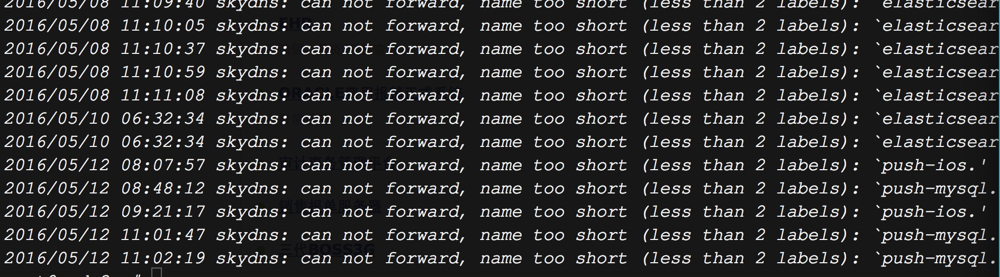

Kubernetes实践——我们踩过的坑
=====================================================

#### 案例一：域名寻址出错，根据内部的域名寻址到错误的IP地址上

创建了一个外部mysql的访问点，为这个访问点生命了一个service(push-mysql)，正常的服务地址为192.168.3.92，但是解析出的IP地址为192.168.90.130，应用连接mysql报错。



https://github.com/kubernetes/kubernetes/issues/8042

https://github.com/kubernetes/kubernetes/issues/10014

https://github.com/kubernetes/kubernetes/issues/5181


#### 案例二：容器已启动，但IP不可达


#### 案例三：kubectl exec -ti $pod /bin/bash，不能进入容器

#### 案例四：RBD盘被锁住，重新创建的Pod不能挂载上这个rbd

Pod创建不成功，使用kubectl describe查看：

![]

使用rbd lock list查看这个镜像（例如：esclient2）

```bash
rbd lock list esclient2
```

如下图所示：

![]


使用rbd lock remove删除rbd锁

```bash
rbd lock remove esclient2 kubelet_lock_magic_ndoe3 client.9789
```

![]
