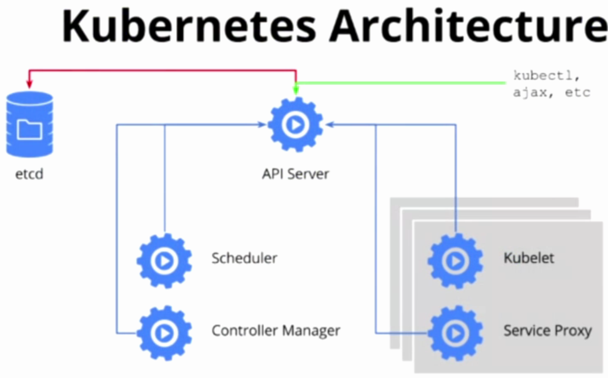

Kubernetes架构设计与核心组件
========================================================

#### 引言
--------------------------------------------------------

Kubernetes是谷歌开源的容器编排引擎，架构和设计思想来源于谷歌内部使用调度工具——Borg。Borg是谷歌一个久负盛名的的内部使用的大规模集群管理系统，它基于Linux Container(LXC)技术，目的是实现资源管理的自动化，以及跨多个数据中心的资源利用率最大化。Borg，或者说LXC技术，在谷歌已经有了十多年的稳定运行经验。2015年4月，伴随着Borg的论文公开发表，Kubernetes也横空出世，迅速占领了容器编排的领袖地位。

Kubernetes是一套完备的容器集群管理引擎，它提供了各种机制和接口来保证应用的快速发布和健康运行，提供了丰富的命令行工具（CLI）和API接口，便于与集群交互，同时Kubernetes提供了多层次的安全防护和隔离机制，多租户应用的支撑能力，应用的全生命周期管理，可扩展的自动资源调度机制，多粒度的资源配额管理能力，多租户支持的统一配置管理组件，多可用区域支撑……，Kubernetes提供了一整套完善的容器管理工具，为容器集群管理提供了一站式服务。

#### 架构设计
--------------------------------------------------------

下图（图1-1）显示了Kubernetes的核心组件：

Kubernetes总体包含两种角色，一个是Master节点，负责集群调度、对外接口、访问控制、对象的生命周期维护等工作；另一个是Node节点，负责维护容器的生命周期，例如创建、删除、停止Docker容器，负责容器的服务抽象和负载均衡等工作。其中Master节点上，运行着三个核心组件：API Server, Scheduler, Controller Mananger。Node节点上运行两个核心组件：Kubelet， Kube-Proxy。API Server提供Kubernetes集群访问的统一接口，Scheduler, Controller Manager, Kubelet, Kube-Proxy等组件都通过API Server进行通信，API Server将Pod, Service, Replication Controller, Daemonset等对象存储在ETCD集群中。ETCD是CoreOS开发的高效、稳定的强一致性Key-Value数据库，ETCD本身可以搭建成集群对外服务，它负责存储Kubernetes所有对象的生命周期，是Kubernetes的最核心的组件。图1-2展示了Kubernetes集群各个核心组件之间的关系：

#### 核心组件
--------------------------------------------------------

下面先大概介绍一下Kubernetes的核心组件的功能：

* *API Server*: 提供了资源对象的唯一操作入口，其他所有的组件都必须通过它提供的API来操作资源对象。它以*RESTful*风格的API对外提供接口。所有Kubernetes资源对象的生命周期维护都是通过调用API Server的接口来完成，例如，用户通过kubectl创建一个Pod，即是通过调用API Server的接口创建一个Pod对象，并储存在ETCD集群中。

* *Controller Manager*: 集群内部的管理控制中心，主要目的是实现Kubernetes集群的故障检测和自动恢复等工作。它包含两个核心组件：Node Controller和Replication Controller。其中Node Controller负责计算节点的加入和退出，可以通过Node Controller实现计算节点的扩容和缩容。Replication Controller用于Kubernetes资源对象RC的管理，应用的扩容、缩容以及滚动升级都是有Replication Controller来实现。

* *Scheduler*: 集群中的调度器，负责Pod在集群的中的调度和分配。

* *Kubelet*: 负责本Node节点上的Pod的创建、修改、监控、删除等Pod的全生命周期管理，Kubelet实时向API Server发送所在计算节点（Node）的信息。

* *Kube-Proxy*: 实现Service的抽象，为一组Pod抽象的服务（Service）提供统一接口并提供负载均衡功能。
