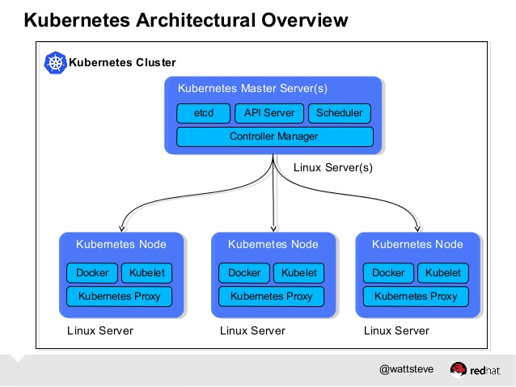
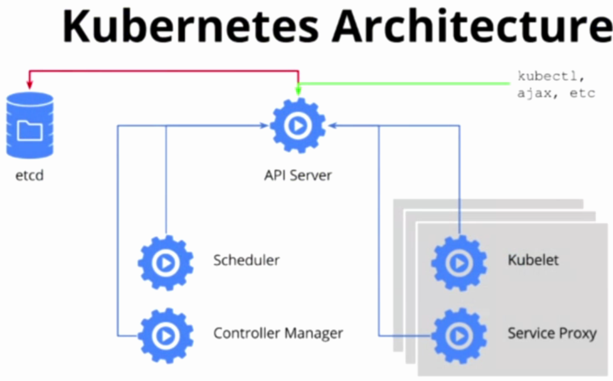
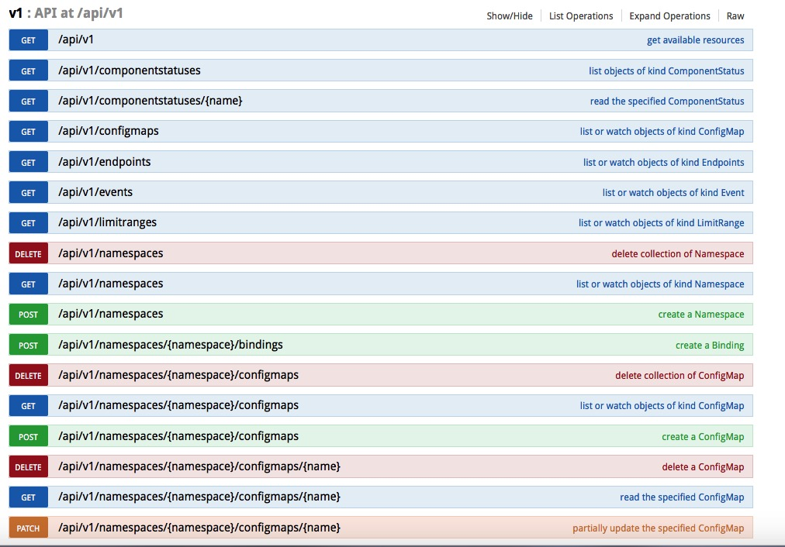
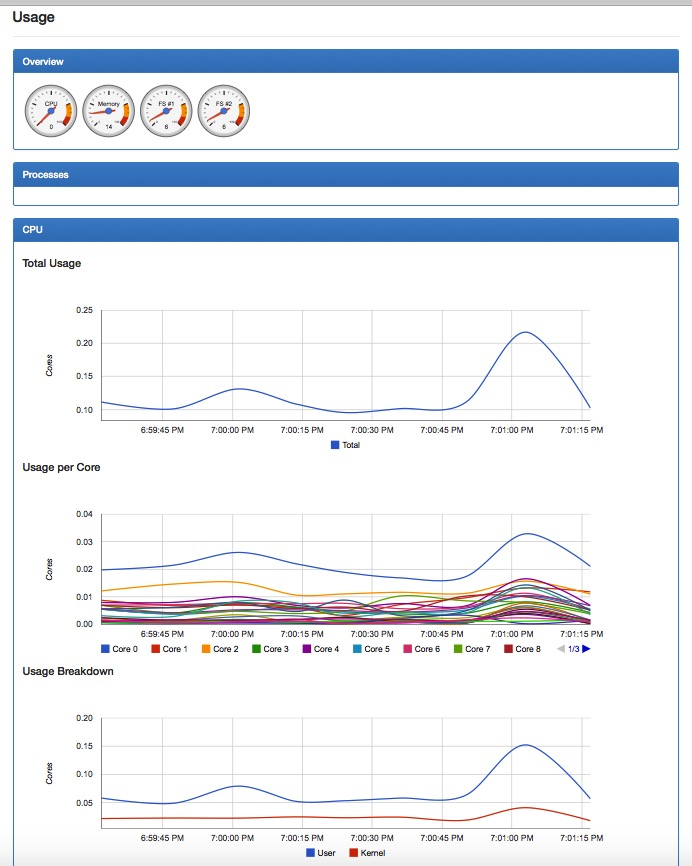

Kubernetes架构设计与核心组件
========================================================

#### 引言
--------------------------------------------------------

Kubernetes是谷歌开源的容器编排引擎，架构和设计思想来源于谷歌内部使用调度工具——Borg。Borg是谷歌一个久负盛名的的内部使用的大规模集群管理系统，它基于Linux Container(LXC)技术，目的是实现资源管理的自动化，以及跨多个数据中心的资源利用率最大化。Borg，或者说LXC技术，在谷歌已经有了十多年的稳定运行经验。2015年4月，伴随着Borg的论文公开发表，Kubernetes也横空出世，迅速占领了容器编排的领袖地位。

Kubernetes是一套完备的容器集群管理引擎，它提供了各种机制和接口来保证应用的快速发布和健康运行，提供了丰富的命令行工具（CLI）和API接口，便于与集群交互，同时Kubernetes提供了多层次的安全防护和隔离机制，多租户应用的支撑能力，应用的全生命周期管理，可扩展的自动资源调度机制，多粒度的资源配额管理能力，多租户支持的统一配置管理组件，多可用区域支撑……，Kubernetes提供了一整套完善的容器管理工具，为容器集群管理提供了一站式服务。


#### 架构设计
--------------------------------------------------------

下图（图1-1）显示了Kubernetes的核心组件：



Kubernetes总体包含两种角色，一个是Master节点，负责集群调度、对外接口、访问控制、对象的生命周期维护等工作；另一个是Node节点，负责维护容器的生命周期，例如创建、删除、停止Docker容器，负责容器的服务抽象和负载均衡等工作。其中Master节点上，运行着三个核心组件：API Server, Scheduler, Controller Mananger。Node节点上运行两个核心组件：Kubelet， Kube-Proxy。API Server提供Kubernetes集群访问的统一接口，Scheduler, Controller Manager, Kubelet, Kube-Proxy等组件都通过API Server进行通信，API Server将Pod, Service, Replication Controller, Daemonset等对象存储在ETCD集群中。ETCD是CoreOS开发的高效、稳定的强一致性Key-Value数据库，ETCD本身可以搭建成集群对外服务，它负责存储Kubernetes所有对象的生命周期，是Kubernetes的最核心的组件。图1-2展示了Kubernetes集群各个核心组件之间的关系：



#### 核心组件
--------------------------------------------------------

下面先大概介绍一下Kubernetes的核心组件的功能：

* *API Server*: 提供了资源对象的唯一操作入口，其他所有的组件都必须通过它提供的API来操作资源对象。它以*RESTful*风格的API对外提供接口。所有Kubernetes资源对象的生命周期维护都是通过调用API Server的接口来完成，例如，用户通过kubectl创建一个Pod，即是通过调用API Server的接口创建一个Pod对象，并储存在ETCD集群中。

* *Controller Manager*: 集群内部的管理控制中心，主要目的是实现Kubernetes集群的故障检测和自动恢复等工作。它包含两个核心组件：Node Controller和Replication Controller。其中Node Controller负责计算节点的加入和退出，可以通过Node Controller实现计算节点的扩容和缩容。Replication Controller用于Kubernetes资源对象RC的管理，应用的扩容、缩容以及滚动升级都是有Replication Controller来实现。

* *Scheduler*: 集群中的调度器，负责Pod在集群的中的调度和分配。

* *Kubelet*: 负责本Node节点上的Pod的创建、修改、监控、删除等Pod的全生命周期管理，Kubelet实时向API Server发送所在计算节点（Node）的信息。

* *Kube-Proxy*: 实现Service的抽象，为一组Pod抽象的服务（Service）提供统一接口并提供负载均衡功能。

#### 核心原理
--------------------------------------------------------

##### API Server
--------------------------------------------------------

* 如何访问Kubernetes API

Kubernetes API通过一个kube-apiserver的进程提供服务，该进程运行在Kubernetes Master节点上，默认的情况下，监听两个端口：

  * 本地端口:  默认值为8080，用于接收HTTP请求，非认证授权的HTTP请求通过该端口访问API Server
  * 安全端口：默认值为6443，用于接收HTTPS请求，用于基于Token文件或者客户端证书及HTTP Base的认证，用于基于策略的授权，Kubernetes默认情况下不启动HTTPS安全访问机制。

用户可以通过编程方式访问API接口，也可以通过curl命令来直接访问它，例如，我们在Master节点上访问API Server：

```bash
curl http://localhost:8080/ap/

{
  "paths": [
    "/api",
    "/api/v1",
    "/apis",
    "/apis/autoscaling",
    "/apis/autoscaling/v1",
    "/apis/batch",
    "/apis/batch/v1",
    "/apis/extensions",
    "/apis/extensions/v1beta1",
    "/healthz",
    "/healthz/ping",
    "/logs/",
    "/metrics",
    "/resetMetrics",
    "/swagger-ui/",
    "/swaggerapi/",
    "/ui/",
    "/version"
  ]
}
```

Kubernetes还提供了一个代理程序——Kubectl Proxy，它既能作为API Server的反向代理，也能作为普通客户端访问API Server，使用方法如下：

```bash
kubectl proxy --port=9090 &
[1] 67686

Starting to serve on 127.0.0.1:9090

curl http://localhost:9090/api

{
  "kind": "APIVersions",
  "versions": [
    "v1"
  ],
  "serverAddressByClientCIDRs": [
    {
      "clientCIDR": "0.0.0.0/0",
      "serverAddress": "10.149.149.3:443"
    }
  ]
}
```

Kubernetes提供了API访问说明，您可以通过浏览器访问http://${KUBE-MASTER}:8080/swagger_ui/来查看RESTful风格API访问规约，如图2-1所示：




##### 集群功能模块之间的通信
--------------------------------------------------------

从图2-2中可以看出，


API Server是整个集群的核心，负责集群各个模块之间的通信。集群内部的功能模块通过API Server将信息存入ETCD，其他模块通过API Server读取这些信息，从而实现各模块之间的信息交互。比如，Node节点上的Kubelet每个一个时间周期，通过API Server报告自身状态，API Server接收这些信息后，将节点状态信息保存到ETCd中。Controller Manager中的Node Controller通过API Server定期读取这些节点状态信息，并做相应处理。Scheduler监听到某个Pod创建的信息后，检索所有符合该Pod要求的节点列表，并将Pod绑定到节点李彪中最符合要求的节点上：如果Scheduler监听到某个Pod被删除，则删除本节点上的相应Pod实例。

从上面的通信过程可以看出，API Server的访问压力很大，这也是限制（制约）Kubernetes集群规模的关键，缓解API Server的压力可以通过缓存来实现，通过watch/list操作，将资源对象的信息缓存到本地，这种方法在一定程度上缓解了API Server的压力，但是不是最好的解决办法。

##### Controller Manager
--------------------------------------------------------

Controller Manager作为集群的内部管理控制中心，负责集群内的Node，Pod，RC，服务端点（Endpoint），命名空间（Namespace），服务账号（ServiceAccount）、资源配额（ResourceQuota）等的管理并执行自动化修复流程，确保集群出处于预期的工作状态，比如，RC实现自动控制Pod活跃副本数，如果Pod出错退出，RC自动创建一个新的Pod，来保持活跃的Pod的个数。

Controller Manager包含Replication Controller、Node Controller、ResourceQuota Controller、Namespace Controller、ServiceAccount Controller、Token Controller、Server Controller以及Endpoint Controller等多个控制器，Controller Manager是这些Controller的管理者。

我们会在以后的文章中深入介绍这些Controller。

##### Scheduler
--------------------------------------------------------

Kubernetes Scheduler负责Pod的调度管理，它负责将要创建的Pod按照一定的规则分配在某个适合的Node上。

Scheduler的默认调度流程分为以下两步：

* 预选调度过程，即遍历所有目标Node，筛选出符合要求的候选节点。为此，Kubernetes内置了多种预选策略供用户选择。

* 确定最优节点，在第一步的基础上，采用优选策略为每个候选节点打分，分值最高的胜出。

Scheduler的调度流程是通过插件方式加载“调度算法提供者”具体实现的，一个调度算法提供者其实就是包括了一组预选策略与一组有限选择策略的结构体，注册算法插件的函数如下：

```golang
func RegisterAlgorithmProvider(name string, predicateKeys, priorityKeys util.StringSet)
```

它包含三个参数：“name string”参数为算法名，“predicateKeys"为为算法用到的预选策略集合，"priorityKeys”为算法用到的优选策略集合。

Scheduler中可用的预算策略包含：NoDiskConflict, PodFitResources, PodSelectorMatches, PodFitHost, CheckNodeLabelPresence, CheckServiceAffinity和PodFitsPorts策略等。其默认的AlgorithmProvider加载的预选策略Predicates包括：PodFitsPorts, PodFitsResources, NoDiskConflict, MatchNodeSelector和HostName，即每个节点只有通过前面的五个默认预选策略后，才能初步被选中，进入下一个流程。

##### Kubelet
--------------------------------------------------------

在Kubernetes集群中，每个计算节点（Node）上会运行一个守护进程：Kubelet。它用于处理Master节点下发到本节点的任务，管理Pod以及Pod中的容器。每个Kubelet进程会在API Server上注册自身节点的信息，定期向API Server汇报节点资源的使用情况，并通过cAdvise监控容器和节点资源。

Kubelet主要功能：

* 节点管理：kubelet可以自动向API Server注册自己，它可以采集所在计算节点的资源信息和使用情况并提交给API Server，通过启动/停止kubelet进程来实现计算节点的扩容、缩容。

* Pod管理：kubelet通过API Server监听ETCD目录，同步Pod清单，当发现有新的Pod绑定到所在的节点，则按照Pod清单的要求创建改清单。如果发现本地的Pod被删除，则kubelet通过docker client删除该容器。

* 健康检查：Pod通过两类探针来检查容器的健康状态。一个是LivenessProbe探针，用于判断容器是否健康，如果LivenessProbe探针探测到容器不健康，则kubelet将删除该容器，并根据容器的重启策略做相应的处理。另一类是ReadnessProbe探针，用于判断容器是否启动完成，且准备接受请求，如果ReadnessProbe探针检测到失败，则Pod的状态被修改。Enpoint Controller将从Service的Endpoint中删除包含该容器的IP地址的Endpoint条目。kubelet定期调用LivenessProbe探针来诊断容器的健康状况，它目前支持三种探测：HTTP的方式发送GET请求; TCP方式执行Connect目的端口; Exec的方式，执行一个脚本。

* cAdvisor资源监控: 在Kubernetes集群中，应用程序的执行情况可以在不同的级别上检测到，这些级别包含Container，Pod，Service和整个集群。作为Kubernetes集群的一部分，Kubernetes希望提供给用户各个级别的资源使用信息，这将使用户能够更加深入地了解应用的执行情况，并找到可能的瓶颈。Heapster项目为Kubernetes提供了一个基本的监控平台，他是集群级别的监控和事件数据集成器。Heapster通过收集所有节点的资源使用情况，将监控信息实时推送至一个可配置的后端，用于存储和可视化展示。
  cAdvisor的截图如下：
  


#### 总结与展望
--------------------------------------------------------

Kubernetes是包含容器云全要素的管理引擎，不仅仅是个容器的编排工具，以kubernetes为基础，可以实现以容器为中心的生态系统，也可以实现软件定义的计算。

Kubernetes使用简单、便捷、易学，这让很多小公司、小团队搭建私有的容器云成为了可能。

截至目前为止，Kubernetes现在已经发布1.2.4版本，1.2版本对于之前的版本增添了很多功能，并且支持1000台节点的集群规模。随着Kubernetes的快速发展和社区的日益火爆，我们相信，越来越多的人会参与到kubernetes的开发和使用中来。

以Docker为代表的容器技术会在最近的几年中得到快速的推广，它将迅速颠覆现有软件发布、运维的现状，甚至会改变互联网的技术生态格局。而且，以Swarm，Kubernetes，Mesos为代表的开源容器云基础组件的出现，更加速了这一过程。

容器技术的火爆预示着一个时代的降临——容器时代，那么，请站上属于你的时代！


