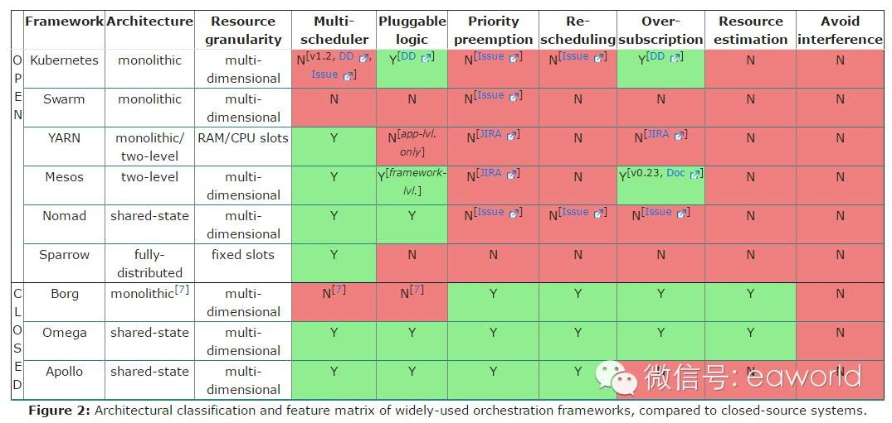
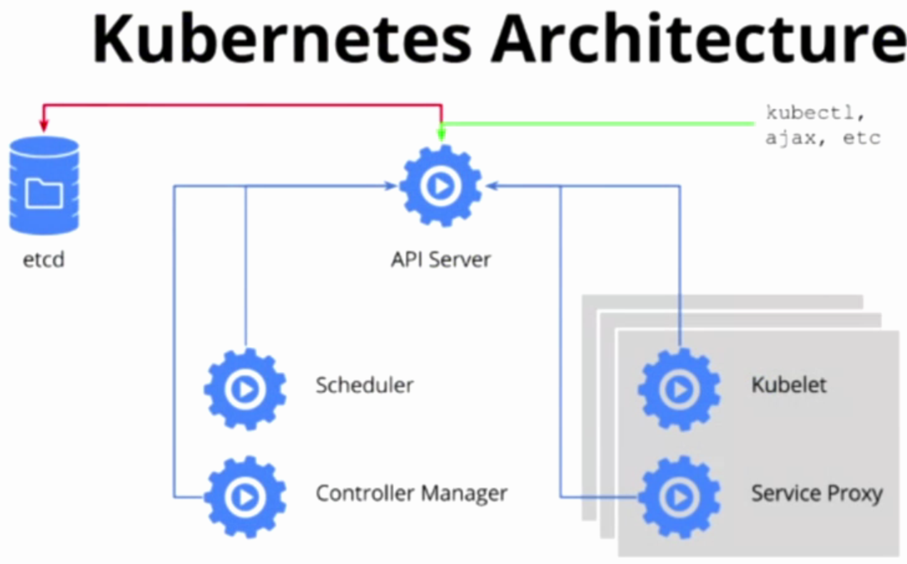
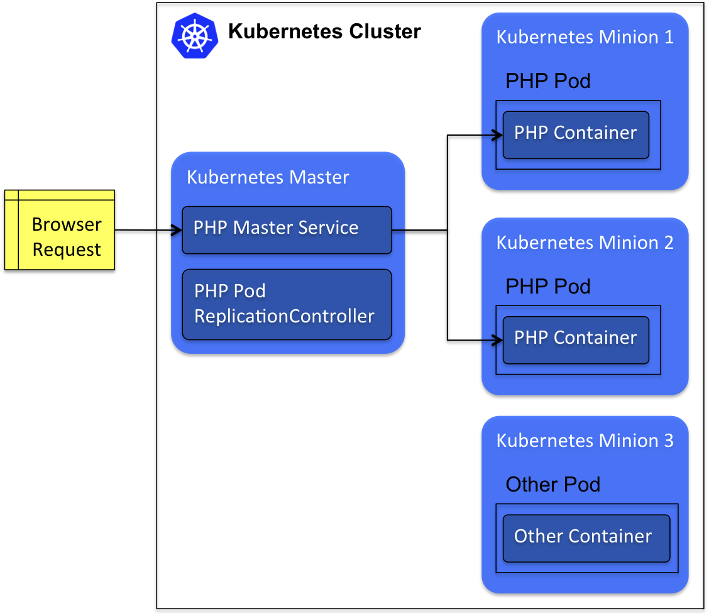

我们为什么选择Kubernetes作为容器集群的调度工具
----------------------------------------------------------------

#### 缘起
----------------------------------------------------------------

##### 初识Docker
----------------------------------------------------------------

2015年年初，从高可用架构群得知Docker会成为未来趋势，就私下看了看，由于工作跟DevOps不相关，看了看就放下了。2015年6月初，由于工作变动，[老板](http://item.jd.com/11905648.html)让调研一下Docker，于是开始了我的Docker之旅。

第一周，学习Docker各种基础知识和常用命令，感觉Docker上手真快，觉得这东西没什么。
第二周，研究Docker使用的底层技术原理，感到了Docker应该是个趋势，至少容器技术应该是个趋势。
第一个月，查阅了很多文章和使用案例，发现了DevOps这块儿新大陆，感觉Docker可以在CI/CD中小试身手。
第二个月，开始容器化了几个线上的应用，开始在生产环境中试运行，看着效果还行。

然后，问题就来了……

##### 关于Docker的困惑
----------------------------------------------------------------

发现手工运行Docker不是办法，既然一个宿主机能运行那么多的容器，总不能自己手工管理吧？这显然是行不通的，还有，跨主机的容器通信怎么做？不会去搞SDN吧？我们团队才一个人啊（囧）。如果使用host模式，端口冲突怎么解决？端口占用怎么管理？自己开发一套管理系统？自己造轮子？好痛苦……

##### 如何管理Docker？
----------------------------------------------------------------

于是查各种资料和开源社区，找到了好多个容器集群的管理方案，有fig（compose），swarm，fleet，flynn，mesos，yarn，deis，kubernetes，看的眼花缭乱……

看到这么多的开源工具，立刻就放弃了自己造轮子的想法，于是，设定筛选条件来选择属于我们的“它“

#### 集群选型
----------------------------------------------------------------

##### 调研
----------------------------------------------------------------

我们提出了几个筛选的条件：

* 出身和口碑(稳定性)
* 是否有先进性或者前瞻性（代表生命力）
* 社区活跃度(稳定性，生命力，口碑）
* 谁来主导（公司还是社区）

经过几次筛选，我们初步确定三个候选条件：

* Swarm: Docker官方的容器编排工具，体量小，使用门槛低，发展快速，不过不建议生产环境使用（当时）

* Mesos: 优秀的容器集群调度工具，致力于打造数据中心操作系统，Apache社区主导，已经证明的能够运行大规模集群的能力，它既可以调度容器，又可以运行一个独立的App，各种服务发现、事件总线……等等，再加上Marathon的调度更是如虎添翼，让人爱不释手，尤其是入门的Hello world，一台虚拟机上，分分钟（不，秒秒钟）起来上千个容器，酷毙了。

* Kubernetes: Google的产品，基于Borg开发，还有那篇[享誉世界的论文](../Kubernetes教程/Kubernetes入门/Large-scale cluster management at Google with Borg.pdf)公开发表，从学术到产业，从现实到未来，Kubernetes都是个好的选择，尤其是，Google主导着Kubernetes的未来方向，最活跃的开发者社区，而且基于Borg(Google大规模集群调度工具)，有多年稳定的使用经验。

Swarm由于不能再生产上使用，加上功能简单，首先出局😢

关于Mesos和Kubernetes选型，从网络上看到这张图

这张对比图(当时)显示了，就资源调度而言，Mesos强于Kubernetes，但是Kubernetes提供的是从资源调度，或者说资源抽象，到服务发现，负载均衡，应用的全生命周期管理的全部功能，而Mesos仅从资源调度，服务管理需要借助Marathon，网络能力聊胜于无。

对于生产环境的稳定性考虑，Mesos是去中心化的，Kubernetes是中心化的，这方面，Kubernetes显然处于劣势，但是，Kubernetes集群有高可用的方案(HA)，可以在某种程度上弥补这个不足，我们期待社区在未来把这块儿完善……

针对我司特有的应用，我们主要是Java Web的应用，都是（Long Time Running）的任务，批处理的任务相对很少，我们关注的重点还是服务治理和应用的生命周期管理。

所以，在Mesos和Kubernetes中，我们更倾向选择Kubernetes。

##### 投注
----------------------------------------------------------------

开始研究Kubernetes的基本原理和核心组件时，很疑惑为什么Google要这么做，随着对Kubernetes理解的深入，发现Kubernetes的架构真是很先进：

* 核心组件的解耦：kubelet负责管理容器的生命周期，kube-proxy负责网络通信和负载均衡，kube-scheduler负责容器的调度，kube-controller-manager负责节点、容器的管理，kube-apiserver负责整个集群资源的创建、存储、销毁。etcd集群负责存储API创建的各种资源。

* 核心概念的正交分解、资源抽象和解耦：

** Pod为Kubernetes的最小调度单元，可以包含一个或者多个容器，用于对容器进行封装，便于容器和宿主机解耦。

** RC负责Pod的副本数，时刻保持可用的副本数，就保证了应用的高可用，对于扩容和缩容，对于RC仅仅就是个数字游戏。

** Service抽象了服务的概念，通过Pod上的标签来选择同一种服务对外提供，简化应用管理的同时，也增加了应用挂历的灵活性，自带的负载均衡服务和服务发现工具，让程序开发和运维部署的工作量降低了个数量级。

** Node是对计算资源的抽象，宿主机作为提供计算资源的单元对外提供服务，使得宿主机跟服务，跟应用完全的解耦。

Kubernetes提供良好的特性，快速的产品迭代和活跃的社区，为Kubernetes提供源源不断的活力和竞争力，所以我们决定，投注Kubernetes。

#### 使用体验
----------------------------------------------------------------

##### Long-Time-Running
----------------------------------------------------------------

我们容器化几个Java web的应用后，将它们部署在Kubernetes集群中，经过长时间的运行观察，Kubernetes提供的运行平台大大降低了我们运维成本，加速了应用的部署周期。但是我们仍然不能确定Kubernetes这次投注我们是赢了。

随着对Kubernetes研究的不断深入，在使用Kubernetes的过程中，我们也遇到了一些问题，当然，都是我们自己的问题。

我们打算用Kubernetes建设我们的私有CaaS（容器即服务），但是在生产环境我们缺少统一配置、ELB、云存储等组件，但是Kubernetes的版本是1.0.6，还没有现在的ConfigMap，DaemonSet，Deployment等功能，我们在Kubernetes落地过程中走到了一个瓶颈。

##### ELK
----------------------------------------------------------------

云存储是我们Kubernetes落地过程中最大的痛点，经过调研，我们决定使用Ceph的RBD来实现私有云的存储管理。关于试用场景，我们采用ELK技术栈来试验，我们将elasticsearch集群、zookeeper集群、kafka集群、fluentd集群容器、kibana集群化后部署在Kubernetes中运行，把es,zk,kafka,fluentd等组件的存储挂载在RBD上，经过几个月运行的观察，效果超出我们预期，Kubernetes+Ceph的技术选型的效果迄今为止还比较不错

云存储解决之后，所谓的解决仅仅是能用而已，完全掌握和优化还要有很长的路要走。

之后，对外自动暴露服务（某种程度上理解为ELB即可）成了我们的瓶颈，正在我们下定决心自己造轮子时，Ingress加入到Kubernetes的计划中了。。。

##### 数据中心
----------------------------------------------------------------

使用Kubernetes抽象计算资源，使用Ceph抽象存储资源，网络资源有VxLan+Iptables管理，我们就实现了简单的软件定义数据中心，这是我们未来的方向。结合“不可变基础设施”和“基础设施即代码”的理念，我们的目标是让数据中心的管理更加简单、便捷，提供的运行环境更加稳定，数据中心的成本和人员的成本大大降低。

经过一段时间的运行，Kubernetes的稳定运行给我们一剂强心针，让我们坚定的走下去，但是，可以预知的情况就是，前进的道路肯定不平台，需要我们团队披荆斩棘，披肝沥胆。

#### 团队
----------------------------------------------------------------

Kubernetes和Ceph虽然从易用性和稳定性上让使用者更加容易上手，但是对Kubernetes和Ceph理解和掌握仍然是一件很困难的事情，需要一个团队来用心的学习、研究，仔细的实践。给打算使用Kubernetes和Ceph的朋友一点建议，如果你不是真心喜欢这两项技术，请不要加入这个团队。

衷心感谢Kubernetes和Ceph的社区，希望有一天也能为社区贡献我们的一点力量。
