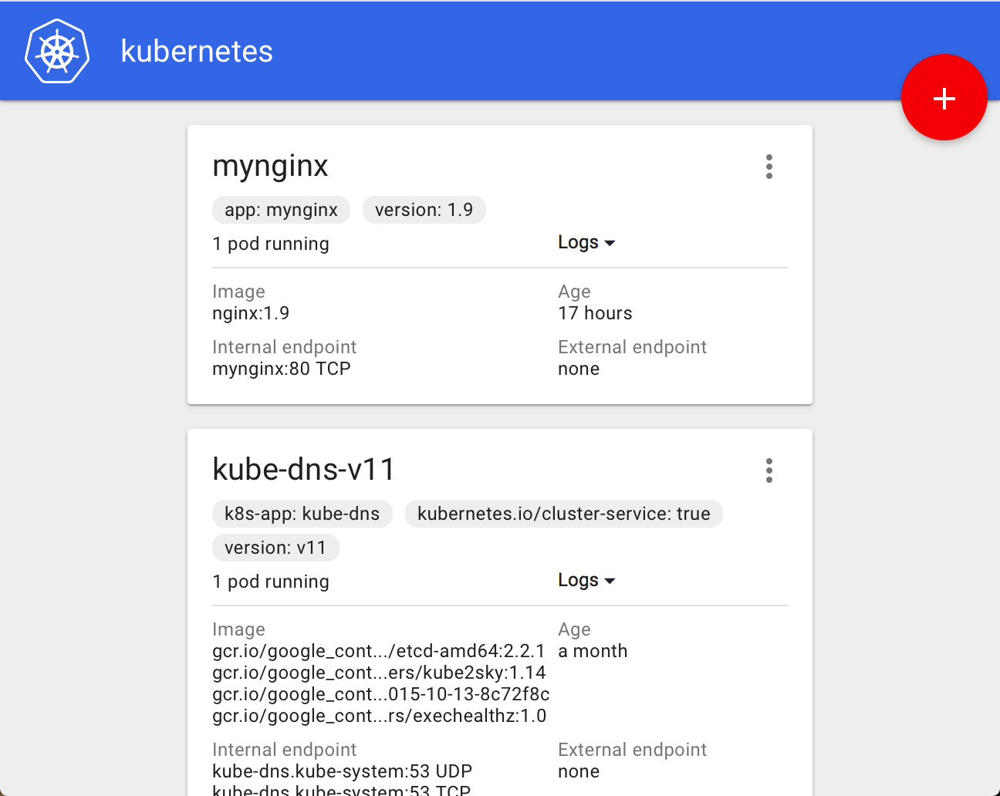

容器引擎管理平台——代码管理
==============================================

#### 概述
----------------------------------------------
代码管理主要完成从代码仓库到镜像仓库的整个过程，其中包括几个主要的阶段：

* 代码克隆：从代码仓库clone到Jenkins集群

* 代码编译：按照设定的方式进行编译，比如java的应用采用maven编译，golang采用go build编译

* 自动化测试：按照不同的技术栈执行自动化测试，测试的结果要反馈给用户

* 构建Docker镜像：将自动化测试通过的代码打包，使用预先设定的构建脚本出发Jenkins构建流程，将代码构建成docker镜像

* 推送这版本仓库：将构建的docker镜像推送至版本仓库，版本号采用代码的git版本号+时间戳的方式

#### 功能设计
----------------------------------------------

##### 代码管理——添加项目

用户登录后，进入代码管理模块面板，页面会以卡牌的形式来展示已经创建的项目，页面上有个加号，点击可以添加新的项目。大概的实现方式如下图所示：

用户在这个面板可以添加项目，可以修改项目，也可以删除项目等。

* 添加项目

添加项目需要录入的信息有：

  * 源代码地址：代码仓库的地址，例如（https://github.com/lth2015/docker-docs.git）

  * 项目名称自动使用git仓库工程的名字，例如，这里项目名称为docker-docs，不可更改

  * 构建的docker镜像的名称，也自动使用git代码的工程名，不可更改

  * 选定该项目的技术栈，例如，java，golang，nodejs，我们当前只考虑支持这三种，而且，第一版本，java只支持maven构建，nodejs只支持npm构建，golang只支持go build方式。之后的方式会在以后的迭代中不断加入。

  * 可选是否执行自动化测试，用户可以选择在构建过程中是否进行自动化测试。自动化测试也是按照不同的技术栈有对应的方式，例如，java使用maven test，golang的使用go test，nodejs使用npm test等。

  * 编写构建镜像的Dockerfile，第一版本只支持手工填写，以后可以支持代码辅助、高亮和预定义模板等功能。

  * 镜像版本自动推算脚本，例如使用代码的git版本+时间戳的方式，这块儿在第一版本中不可编辑，以后可以考虑放开

* 修改项目

* 删除项目

##### 代码管理——设置功能

用户登录后，进入代码管理模块，可以点击设置功能
